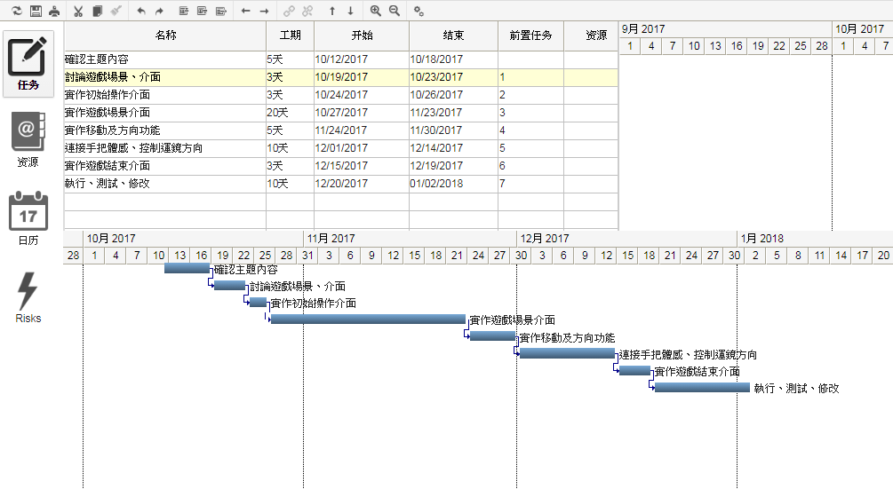
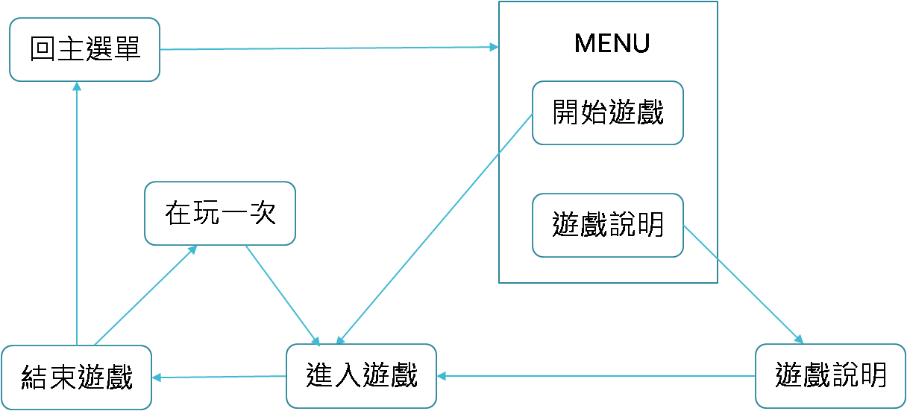
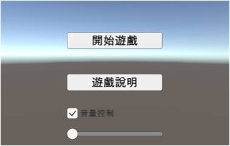
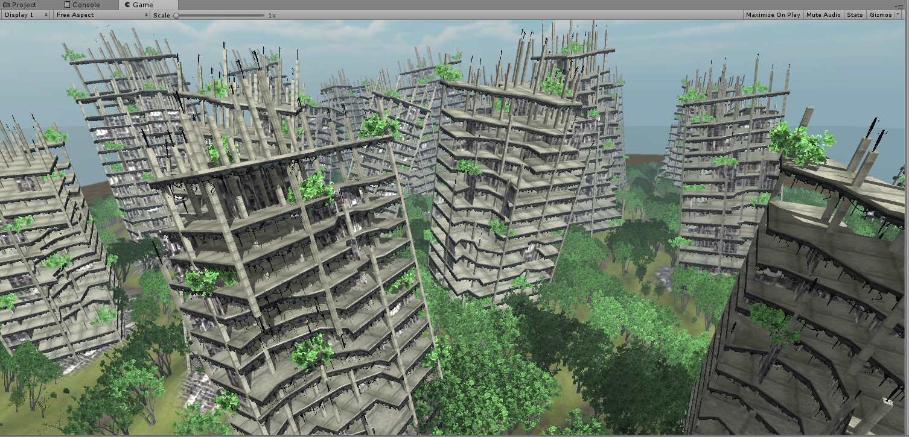

# 第十九組
# 專案名稱：VR滑翔翼
# 指導老師：黃文楨
# -------------
# 組員：0424015朱凱菱
#              0424076林奕全
#              0424080曾茜筠
# -------------

# 專案介紹:在虛擬環境中用體感裝置控制飛行的方向，通過空中出現的圓環便可加分累積分數，通過越多分數越高，碰到障礙物則結束遊戲。
# 專案效益:讓忙碌的現代人在家裡玩遊戲也能動一動身體，有助於身心靈的健康，也能讓年老者活化腦細胞，減緩衰老，是一個老少咸宜的遊戲。
# 初步作法:利用Unity建立進入遊戲主選單及遊戲場景，加入體感設備偵測手部角度，控制飛行方向，設計圓環並撰寫累積分數程式
# 網址:https://github.com/ggoso4501/u0424076
# 功能性:
# 1.遊戲開始的介面採第一人稱視角
# 2.偵測兩隻搖桿的相對高度，判斷直行、向左或向右
# 3.
# 非功能性:
# 1.造景的美化
# 2.
# 甘特圖

# WND視窗導覽圖

# 場景介紹

